# Homework : Hyper-parameter tuning based on CNN

## Introduction

- Implementing  a deep neural network in Pytorch
- Training it on CIFAR10.
- Tuning a hyper-parameter and analyzing its effects on performance.

## Experimental Design

- **Dataset**: Cifar10

  Train:10×（4500 ×32 ×32） 

  valid 10×（500 ×32 ×32） 

  Test：10000 ×32 ×32

- **Framework**: pytorch

- **Network**: simple CNN

  ```python
  class Net(nn.Module):
      def __init__(self,num_input_channels=3,num_classes=10):
          super(CNNNet, self).__init__()
          self.conv1=nn.Conv2d(3,16,3,padding=1)
          self.conv2=nn.Conv2d(16,32,3,padding=1)
          self.conv3=nn.Conv2d(32,64,3,padding=1)
          self.pool=nn.MaxPool2d(2,2)
          #Linear layer(4×4×64->500)
          self.fc1=nn.Linear(4*4*64,500)
          #Linear layer(500->10)
          self.fc2=nn.Linear(500,10)
          #dropout(p=0.3)
          self.dropout=nn.Dropout(0.3)
  
      def forward(self,x):
          x=self.pool(F.relu(self.conv1(x)))
          x=self.pool(F.relu(self.conv2(x)))
          x=self.pool(F.relu(self.conv3(x)))
          #flatten image input
          x=x.view(-1,64*4*4)
          # add dropout layer
          x=self.dropout(x)
          # add 1st hidden layer, with relu activation function
          x=F.relu(self.fc1(x))
          # add dropout layer
          x = self.dropout(x)
          x=self.fc2(x)
          return x
  ```

- In this task, the hyperparameter tuning is mainly performed on the **learning rate** of the convolutional neural network,and using different learning rate strategies.Based on the accuracy curve in the training process, including training, validation and testing,evaluate and analyze the performance of the network.

## Methods and Results

Empirically and Specifically, the learning rate is a configurable hyperparameter used in the training of neural networks that has a small positive value, often in the range between 0.0 and 1.0. Part 1 

### Part 1

Under the same experimental setting, set different learning rates,Epoches=100

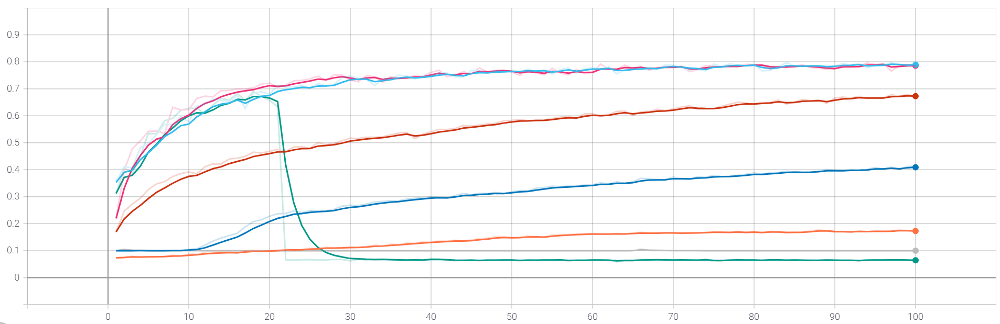

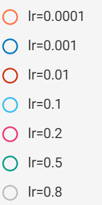

The above chart shows the performance of the model on the validation set(accuracy) in each epoch of the training process(The next few sets of experiments are based on the same way to evaluate the effectiveness of the corresponding strategy).

We can clearly see the influence of the choice of learning rate on the model effect update during the training process. When lr=0.0001/0.001, it is a relatively small learning rate, resulting in a slow model update; and lr =0.1/0.2 is an appropriate value, the model is updated at a reasonable speed; and when the learning rate increases to lr=0.5, after several iterations of training, the model collapse.This shows that at the beginning of training, due to random initialization, the loss of the model is large, resulting in a large gradient. At this time, if a large learning rate is used, it will cause the model to fail in the middle of training.

### Part 2 

> **Momentum** is a method that helps accelerate SGD in the relevant direction and dampens oscillations
> $$
> v_{t}=\beta v_{t-1}+(1-\beta) \theta_{t}
> $$

This part of the experiment is to explore the effect of adding momentum to the gradient descent process. 

The first experiment is to add momentum to the stochastic gradient descent ($$\beta$$= 0.9), it can be clearly observed that the gradient descent method combined with momentum accelerates the training process to a certain extent.

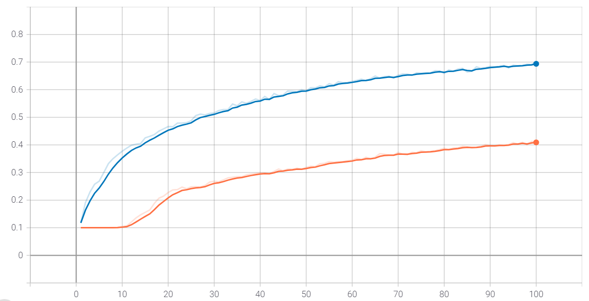

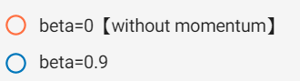

The second set of experiments is based on different momentum parameters and takes several common  values of momentum parameters [$$\beta=0.5,\beta=0.9,\beta=0.95,\beta=0.99$$].It can be observed from the chart that in this task, $$\beta=0.9$$ is a relatively good value for the momentum parameter, and  the momentum parameter value is not the bigger the better. For example, when $$\beta =0.95$$ or $$\beta=0.99$$,compared with $$\beta=0.5$$, the model is updated very quickly at the beginning, but no effective updates can be made in the following epochs,understanding from the corresponding formula, it is because the previous parameter value is given too much weight.

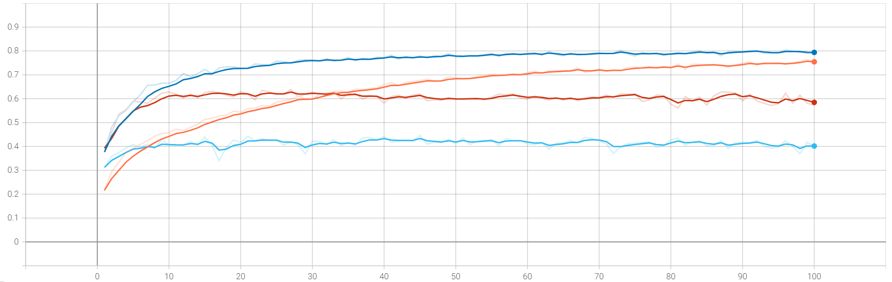

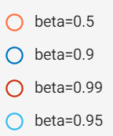

### part 3

> Nesterov Accelerated Gradient is **a momentum-based SGD optimizer** that "looks ahead" to where the parameters will be to calculate the gradient ex post rather than ex 

The purpose of this part of the experiment is to verify the effect of nesterov. Take  $$lr=0.01,momentum \beta=0.9,without nesterov$$ as the comparison object, and compare the momentum update method of nesterov. According to the experimental results, it can be clearly seen that the addition of nesterov can greatly speed up the convergence speed of the gradient descent optimization algorithm.

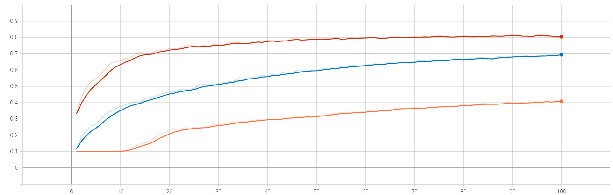

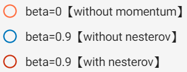

### part4 

warm up

Based on the following parameters $$lr=0.01,\beta=0.9,nesterov=True$$, a comparative experiment was carried out to compare the case of using warmup and the case of not using warmup. It can be seen from the chart that the first part of the training of the training chart is intercepted, and it can be seen that the training process combined with the warmup strategy is relatively stable at the beginning (the update is not so fast though,which can be helpful to the whole process of training.

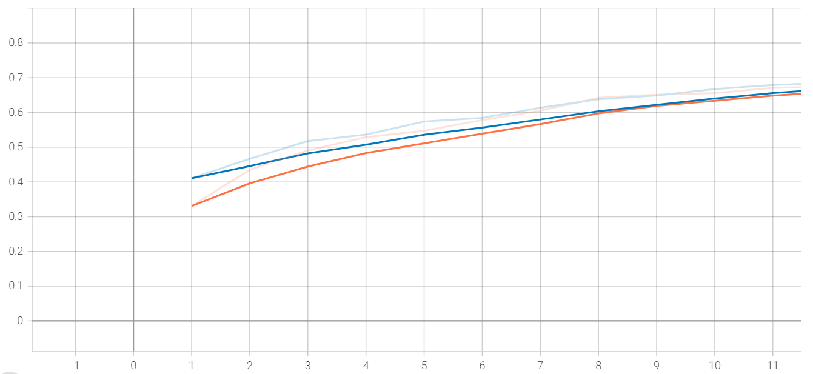

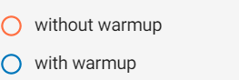

part 5 结合阶梯学习率衰减策略

$$ epoch=200,lr=0.01,\beta=0.9,nesterov=True$$

$$adjust-lr=[50, 100, 150],lr-decay-ratio=0.2$$

This is the final hyperparameter solution for the learning rate. Based on the results of the previous experiments and combined with  a  learning rate decay strategy according to a pre-defined schedule, the final result shows that the model can converge to the accuracy around 0.838 on the test set.

- Train accuracy

  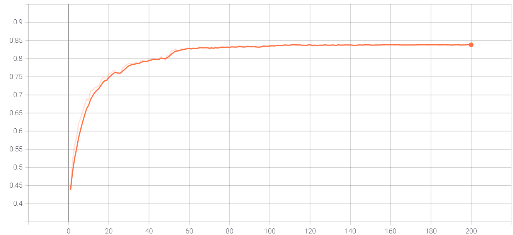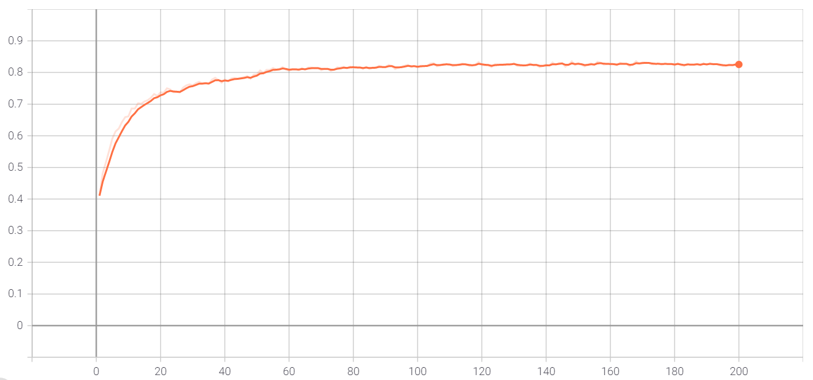

- Valid accuracy

  

- Test accuracy

  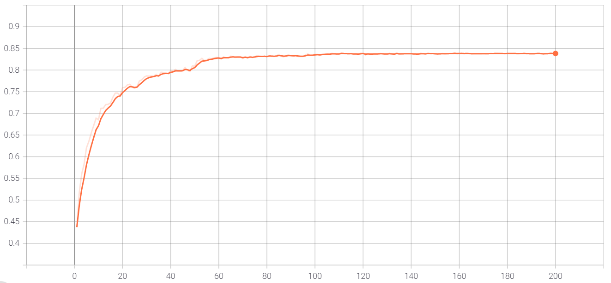

## Conclusions

Deep learning neural networks are trained using the stochastic gradient descent optimization algorithm.The learning rate is a hyperparameter that controls how much to change the model in response to the estimated error each time the model weights are updated. Choosing the learning rate is challenging as a value too small may result in a long training process that could get stuck, whereas a value too large may result in learning a sub-optimal set of weights too fast or an unstable training process.


- How large learning rates result in unstable training and tiny rates result in a failure to train.
- Momentum can accelerate training and learning rate schedules can help to converge the optimization process.

## Reference

[An overview of gradient descent optimization algorithms](https://ruder.io/optimizing-gradient-descent/index.html#momentum)

[Understand the Impact of Learning Rate on Neural Network Performance](https://machinelearningmastery.com/understand-the-dynamics-of-learning-rate-on-deep-learning-neural-networks/)